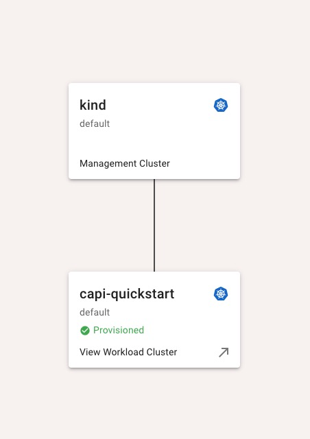
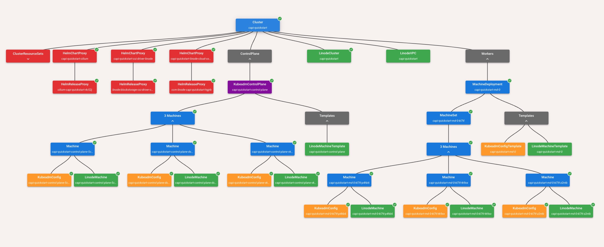

# Kubernetes and ClusterAPI

## Introduction

This document contains all my learnings on Kubernetes and ClusterAPI.

## Table of Contents

- [Cluster creation](#cluster-creation)
- [Application Deployment](#application-deployment)
- [Deployment using Cluster-API](#deployment-using-cluster-api)
- [Complimentary Tech Learnt](#complimentary-technology)

## Cluster creation

Different methods of cluster creation:

- #### Using `kind` to create a local cluster
- #### Creating a cluster on linode cloud manager
- #### Creating a `k3s` cluster from scratch
  - This method was the most helpful one in understanding how clusters are created.
  - It involved provisioning nodes manually and setting them up as control-plane nodes and worker nodes and linking them together.
- #### Creating a `kubeadm` based cluster using `clusterctl`

## Application Deployment

- ### General steps to deploy:
  - Installing dependencies
  - Configuring the cluster ports
  - Pulling oci images for deployment in pods using manifests
  - Exposing the right ports alongside load-balancer services

- ### Helm charts
  - While deploying a service, I found the use of helm charts to be extremely beneficial as it abstracted the
    process of creating manifests for pre-existing services. Ex: Redis

- ### Ingress and Load Balancers
  - While creating your service as a `NodePort` and port-forwarding to it was easy, it wasn't the best method to
    expose the application
  - In-order to utilize all `n` nodes in the cluster, a load balancer service must be setup, along with an ingress
    service (ex: nginx)
  - While setting up the load balancer, the round-robin algorithm was used. But based on the circumstance, the algorithm
    can be changed

The deployment procedure generally followed this format with slight changes based on which provider was being used for
deployment.

## Deployment using Cluster API

- ### Management cluster 
  - Used kind as my management cluster with one control-plane

- ### Worker cluster
  - Deployed with linode as infrastructure provider
  - Cluster contained 3 control-plane nodes and 3 worker nodes

- ### Controllers and Drivers
  - CSI Driver and CCM are responsible for installation and usage of volumes, object buckets, PVCs, VPCs, helm charts etc
    - Each controller is responsible for deployment or initialization of a service
      For example, the `linodemachine_controller` is responsible for provisioning of machines when deploying
      an application

- ### Control Plane & Worker Nodes
  - CAPI has multiple flavours available, the default flavor is `kubeadm`
  - With the default flavor selected, `clusterctl` can be used to provision the cluster, which generated a `KubeadmControlPlane`
    with `n` nodes for the control plane. In my case, there are 3 control-plane nodes and 3 worker nodes
  - The worker nodes are deployed as part of a `MachineSet` under which the provisioned nodes fall under. This is done
    in-order to ensure that the nodes status is monitored at all times, and increase ease of updating nodes 
    and rollbacks if necessary
  - `LinodeMachines` are provisioned based on the `KubeadmConfig` generated on the management cluster. This manifest
    determines the spec of each provisioned `LinodeMachine`. Templates can be set based on requirement

## Overview of the clusters

## Workload Cluster

## Complimentary Technology

In-order to increase the ease of deploying a cluster, learning the basics of the following tech helped

- ### Helm
- ### K3s
- ### nginx

